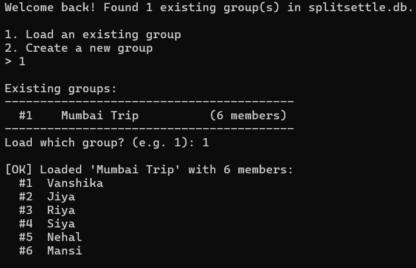
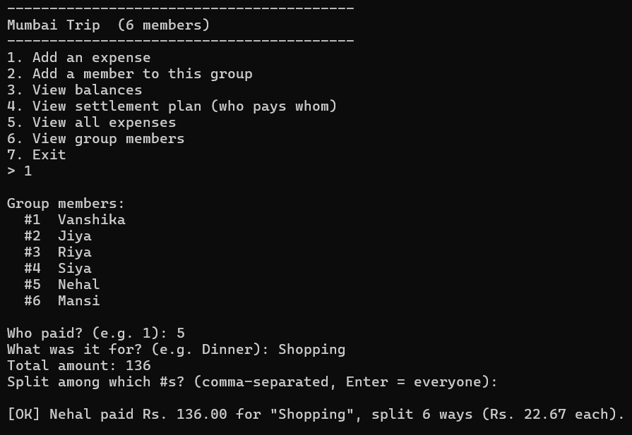
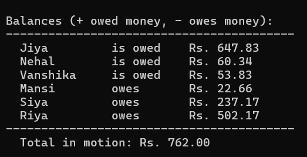
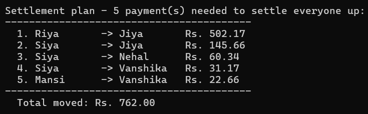

```markdown
# SplitSettle — Debt-Simplification Engine for Group Expenses

A group expense tracker for roommates, trips, and shared events. The core
problem is not splitting bills but minimizing settlement friction: given a
group with arbitrary many-to-many debts (A owes B, B owes C, C owes A), the
engine computes the minimum number of transactions required to settle every
balance to zero, using a greedy max-heap matching algorithm.

## Demo
A walkthrough of a typical session, in order.

### 1. Start the app
Choose to load an existing group or create a new one. Data persists across
runs via SQLite.


### 2. Log an expense
Enter the payer, description, amount, and participants.


### 3. View balances
Per-person net position, computed from all logged expenses.


### 4. View the settlement plan
The minimized set of payments produced by the debt-simplification algorithm.


## Stack
- Java 17, JDBC, SQLite — no ORM, no framework, no server dependency
- Command-line interface (Scanner-based)
- JUnit 5 for algorithm tests

## Setup
1. Requires Java 17+ and Maven. SQLite is embedded, so no separate database
   server or credentials are needed.
2. Run:
   ```
   mvn compile exec:java -Dexec.mainClass=com.splitsettle.Main
   ```
   In PowerShell, quote each argument:
   ```
   mvn compile "exec:java" "-Dexec.mainClass=com.splitsettle.Main"
   ```
3. On first run, the app creates `splitsettle.db` in the project directory
   and initializes the schema automatically.
4. Run tests:
   ```
   mvn test
   ```

The database file location can be overridden with the `SPLITSETTLE_DB_PATH`
environment variable (default: `splitsettle.db`).

## Usage
1. On startup, choose to load an existing group or create a new one. New
   groups require a unique name and unique member names (letters only).
2. Log an expense: payer, description, amount, and participants (defaults
   to all members if left blank).
3. View balances — per-person net position (owed / owes).
4. View the settlement plan — the minimized set of payments, with an option
   to save it.
5. View all logged expenses or the group member list at any time. Members
   can be added to a group after creation.

Invalid input (unknown user IDs, non-numeric or non-positive amounts,
duplicate or non-letter names) is rejected with a message and re-prompted.

## Inspecting the data
```
sqlite3 splitsettle.db
.tables
SELECT * FROM users;
SELECT * FROM expenses;
```

`group_members` stores raw `group_id`/`user_id` pairs. The bundled
`group_membership` view resolves these to names:
```
SELECT * FROM group_membership WHERE group_name = 'Goa Trip';
```

## Design Notes
## Design Notes

- **Algorithm:** Greedy heap-based matching (max-heap of creditors, min-heap of debtors). Guarantees at most **n − 1** transactions for **n** people and runs in **O(n log n)**.

- **Rounding:** Equal splits use `BigDecimal` with remainder distribution so shares always sum exactly to the original amount.

- **Schema:** `users`, `groups`, and a `group_members` join table model the many-to-many relationship between people and groups. `group_membership` is a read-only view for convenience.

- **Persistence:** SQLite, chosen for a single-user CLI tool to avoid server setup and credential management.

- **Schema Initialization:** `SchemaInitializer` runs `CREATE TABLE IF NOT EXISTS` statements on every startup, so the schema is created once and existing data is left untouched thereafter.

- **Data Access:** Raw JDBC, with explicit transaction boundaries (`commit`/`rollback`) around multi-table writes such as expense creation and group creation.

- **Error Handling:** A `SplitSettleException` hierarchy (`UnbalancedSharesException`, `UnbalancedLedgerException`, `InvalidExpenseException`, and `UnknownUserException`) separates expected domain-rule violations from unexpected failures such as `SQLException`.

- **Use Case:** The netting pattern applied here—minimizing transactions across many bilateral debts—is the same principle used at larger scale in payment platforms and interbank settlement systems.
```
